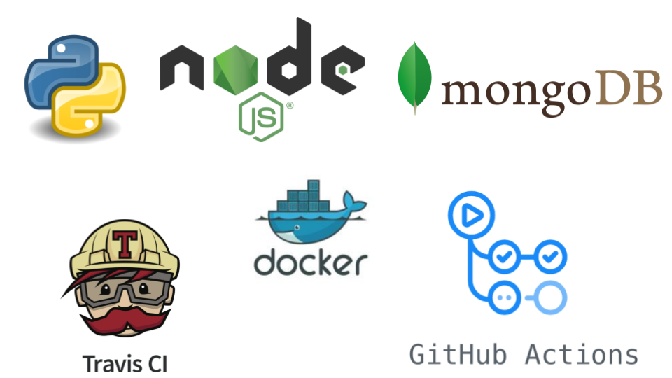

# blue-origin-x-20-21-soa-20-21-f
* Auteurs: **Team F**
    * AINADOU Florian
    * DJEKINOU Paul-Marie
    * KOFFI Paul
    * NABAGOU Djotiham
* Version actuelle : DELIVERY-FINAL
* Livrables :
    * [delivery-first](https://github.com/pns-si5-soa/box-20-21-team-f/releases/tag/delivery-first) : Première livraison
    * [delivery-final](https://github.com/pns-si5-soa/box-20-21-team-f/releases/tag/delivery-final) : Livraison finale
* Statuts d'Intégration continue : 
  
# Vue d'ensemble
 Cette étude de cas est utilisée pour illustrer les différentes technologies impliquées dans le cours d'Architecture Orienté Services (SOA) donné à Polytech Nice - Sophia Antipolis en 5e année.
 
 Ce code de démonstration nécessite les technologies suivantes pour fonctionner correctement :
       
   * Environnement de déploiement : Docker 2.2.0.5 (Stable)
   * Langage d'implémentation Python & Pip : Python3 & Pip3
   
   
  ## Vision du produit
  La dernière version du produit à implémenter est décrite  [ici](./docs/scope_final.pdf).
    
  L'architecture logicielle à développer dans ce projet est incrémentale et évolue tout le long du projet.
  
  Le schéma final d'architecture se présente comme suit : 
  <p align="center">
      
  </p>
  
 ## Rapport du projet
 Le rapport final du projet se trouve 👉 [ici](./docs/rapport-delivery-final.pdf)
 
 PS : 
 * Toutes les images et illustrations utilisées dans ce rapport et dont les dimensions sont réduites en raison du format A4, sont disponibles en taille *réelle* dans le répertoire [docs](./docs) à la racine de ce projet.
 * S'assuer d'être bien authentifié sur github (ou d'avoir les droits sur le repo) si accès aux images directement depuis les liens inscrits dans le rapport (en légende des figures).
 * Le rapport du livrable *delivery-first* est également disponible 👉 [ici](./docs/rapport-delivery-first.pdf)
 
 
  
  ## Comment utiliser ce repository
  * La branche `master` (la branche par défaut) représente la dernière version stable du système.
  * La branche `develop` représente le système en cours de développement en parallèle des autres branches de développement spécifiques à des problématiques ou relatifs aux diverses tâches attribuées.
  * Les issues peuvent être créés en utilisant le [système de ticket de Github](https://github.com/pns-si5-soa/blue-origin-x-20-21-soa-20-21-f/issues)
  
  ## Récupération du projet
  Effectuer un clone classique du projet en faisant ```git clone https://github.com/pns-si5-soa/box-20-21-team-f.git``` ou en récupérant le zip depuis cette page.
  
  ## Compilation & Exécution  
  La compilation et l'exécution s'effectuent via des conteneurs *Docker* correspondants aux différents micro-services et autres acteurs du système.
  Le lancement et démarrage de ces conteneurs est automatisé grace à l'exécution de scripts.
     
  1- Exécuter le fichier [prepare.sh](./prepare.sh) à la racine du projet afin de compiler et exécuter toutes les images docker.
  
  PS : 
  
  La première fois, la compilation et exécution (prepare.sh) peut prendre du temps en raison du téléchargement des images docker.
    
  <p align="center">
    
  </p>

  <p align="center">
    
  </p>
  
  Vous pouvez vous rendre dans l'onglet [github Actions](https://github.com/pns-si5-soa/box-20-21-team-f/actions) pour voir en détail l'exécution du *prepare.sh* et des tests.
  
  2- Exécuter le fichier [run.sh](./run.sh) pour lancer les scénarios et tests d'acceptance.
  
  3- Exécuter le fichier [saveContainerLogsInFile.sh](./saveContainerLogsInFile.sh) pour sauvegarder les logs des services ```REST``` tournant sur les conteneurs Docker. Les logs sont consultables dans le dossier [logs](./logs) à la racine de ce projet.
 
  4- Exécuter le fichier [displayLaunchLogInDatabase.sh](./displayLaunchLogInDatabase.sh) pour afficher les logs stockés dans la BD, qui décrivent le scénario de bout en bout.    
  
  ## Cas critique :rotating_light:
  
  Vous pouvez vous référer à l'onglet githubActions (on y visualise tous nos plan de build) qui montre  exactement les mêmes informations obtenues en local lorsqu'on exécute
  le prepare ainsi que le run. Les plans de build dans github Actions tournent avec Unbuntu 16.
  
  Dans le cas où la démo ne s'exécuterait pas comme prévu, nous avons aussi enregistré une vidéo montrant l'exécution du scénario de bout en bout depuis un clone du projet.
  
  Lien de la vidéo  [ici](https://drive.google.com/drive/folders/1CvdClWkCQ65hPNajppDsC0R8GYaWIAC4?usp=sharing).
  
  PS:
  
   * L'exécution du [run.sh](./run.sh) est automatisé (encapsulé dans le [prepare.sh](./prepare.sh)) au cours de cette vidéo.
   * Les logs sont également disponibles dans le répertoire vers lequel mène le lien de la vidéo.
     
  
# Visualisation des logs
  
  Les tests cucumber n'étant pas assez verbeux mais permettant de tester plus proprement les fonctionnalités du système, nous avons
  pris le soin de tenir à jour des logs de nos conteneurs Docker qui se trouvent tous dans le dossier [logs](./logs).
  Au fur et à mesure que les tests du *run.sh* s'exécutent, vous pouvez voir les logs de ces fichiers s'actualiser, excepté ceux de nos services REST
  que l'on récupère à la fin de l'exécution de tous les tests grâce à un script python [saveContainerLogsInFile.sh](./saveContainerLogsInFile.sh).
  
 Voici en détail les principaux fichiers de Logs et leur signification :
 
 ```maryDashboardLogs``` : qui permet de suivre l'évolution de tous les scénarios déroulés dans le test (Poll, launch, destruction , etc ...).
 
 ```jeffDashboardLogs``` : qui permet de suivre l'évolution des données télémétriques du first et du secondStage ainsi que la destruction de ceux-ci.
 
 ```gwynneDashboardLogs``` : qui permet de suivre l'évolution des données télémétriques du payload ainsi que sa destruction.
 
 ```firstStageLogs``` : qui permet de suivre toutes les étapes de lancement du firstStage ainsi que son retour sur terre après séparation avec le secondStage.
 
 ```triggerAnomalyServiceLogs``` : qui permet de suivre en détail la vérification des données télémétriques par le triggerAnomalies Service.

 ```pollSystemLogs``` : qui permet de suivre en détail les *polls* lancés par Richard.
  
# Auto-évaluation du travail réalisé
  
  Avec une bonne base d'architecture dès les 2 premiers scopes, nous avons démarré le projet sur les bons rails. Au fur et à mesure que nous
  recevions de nouvelles User Story, nous avons toujours isolé les blocs de fonctionnalités dans des petits services pour éviter un fort couplage. Cette démarche 
  nous a certes conduit à un grand nombre de microservices mais ce découpage très fin nous a permis d'intégrer kafka très facilement. Finalement, nous n'avons pas vraiment eu
  un gros blocage technique. Notre seul regret reste la migration de nos services nodeJS vers python dûe à la latence des consumers node. Nous aurions bien aimé continuer avec
  les 2 technos. 
  
  Nous avons également tiré leçon des erreurs de notre premier rendu qui concernaient plus l'exécution du projet lui-même que la solution
  proposée.
    
  Chaque membre du groupe s’est sérieusement impliqué dans ce projet. De ce fait, nous nous répartissons les 400 points de la façon suivante :
    
  Florian AINADOU : ```100 points```
    
  Djotiham NABAGOU : ```100 points```
    
  Paul KOFFI  : ```100 points```
    
  Paul-Marie DJEKINNOU : ```100 points```
  
# Pile technologique
  
  <p align="center">
    
  </p>
