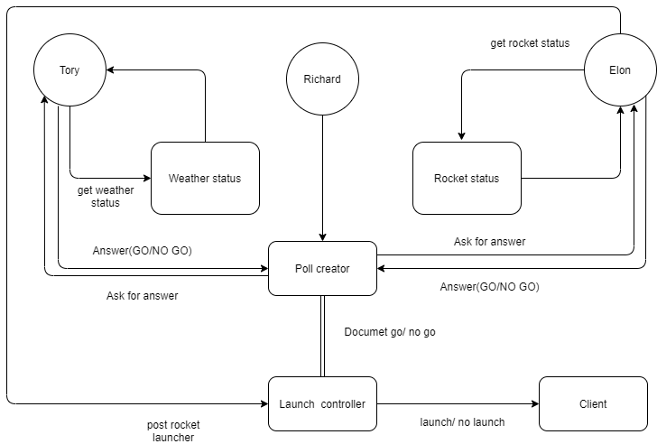
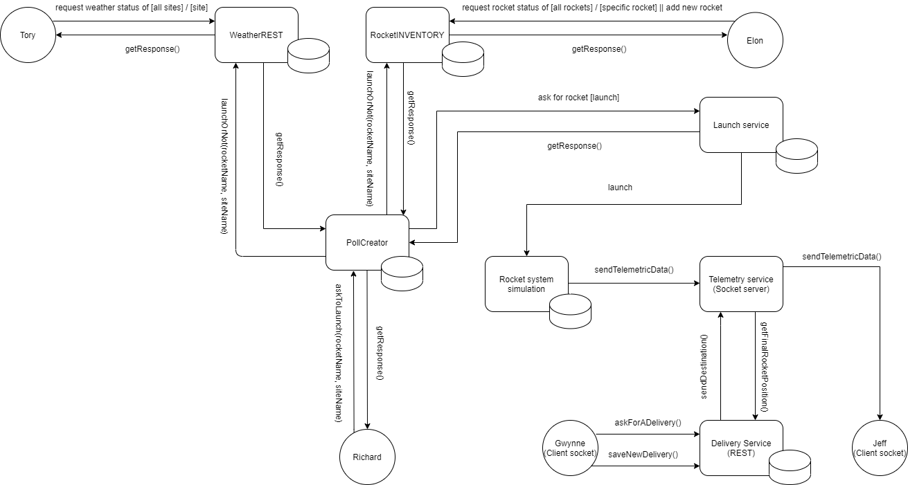
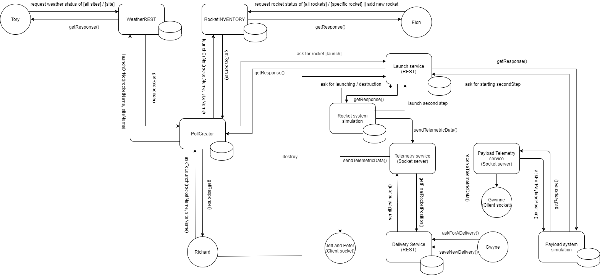
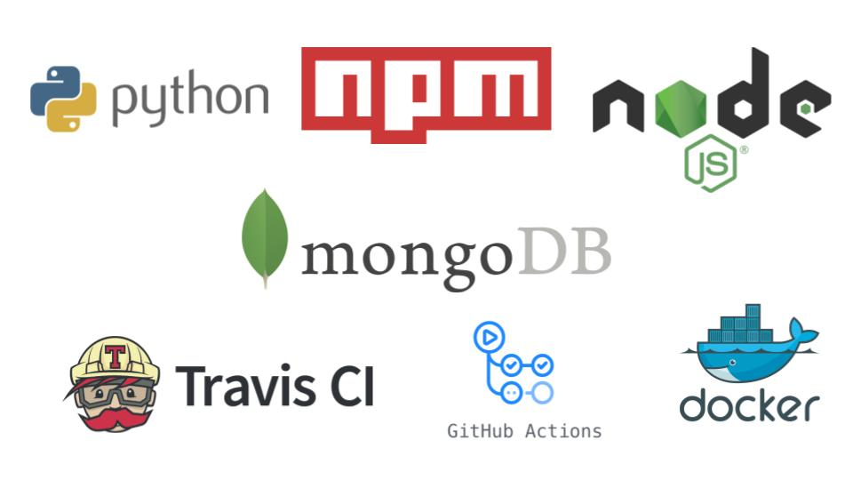

# blue-origin-x-20-21-soa-20-21-f
* Auteurs: **Team F**
    * AINADOU Florian
    * DJEKINOU Paul-Marie
    * KOFFI Paul
    * NABAGOU Djotiham
* Version actuelle : en développement (MVP - Sprint 1)
* Releases :
    * [Sprint 1](https://github.com/pns-si5-soa/box-20-21-team-f/releases/tag/sprint1) : Semaine 1 de dev
* Statuts d'Intégration continue : [](https://travis-ci.com/pns-si5-soa/box-20-21-team-f)
  
# Vue d'ensemble
 Cette étude de cas est utilisée pour illustrer les différentes technologies impliquées dans le cours d'Architecture Orienté Services (SOA) donné à Polytech Nice - Sophia Antipolis en 5e année. Ce code de démonstration nécessite les logiciels suivants pour fonctionner correctement :
 
   * Environnement de Build & de configuration Npm : Npm 6.14.8        
   * Environnement de déploiement : Docker 2.2.0.5 (Stable)
   * Langage d'implémentation Javascript : Node JS v12.14.1
   * Langage d'implémentation Python : Python 3
   
   
  ## Vision du produit
  Le produit à mettre en oeuvre évolue itérativement sur plusieurs semaines :   
   👉 [Version 1](./docs/scope_1.pdf)   
   👉 [Version 2](./docs/scope_2.pdf)   
   👉 [Version 3](./docs/scope_3.pdf) 
    
  L'architecture logicielle à développer dans ce projet est également incrémentale et se présente comme suit :
  
  👉 Version 1 :
  <p align="center">
      
  </p>
  
  👉 Version 2 :
    <p align="center">
        
    </p>
  
  👉 Version 3 :
    <p align="center">
        
    </p>
    
 ## Rapport
 Le rapport du projet se trouve 👉 [ici](Rapport%20Box-20-21-team-f.pdf)   
  
  ## Comment utiliser ce repository
  * La branche `master` (la branche par défaut) représente la dernière version stable du système.
  * La branche `develop` représente le système en cours de développement.
  * Les issues peuvent être créés en utilisant le [système de ticket de Github](https://github.com/pns-si5-soa/blue-origin-x-20-21-soa-20-21-f/issues)
  * La suite des fonctionnalités à implémenter peuvent être consultées dans le [backlog](https://github.com/pns-si5-soa/blue-origin-x-20-21-soa-20-21-f/milestone/2)
  
  ### Récupération du projet
  Effectuer un clone classique du projet en faisant ```git clone https://github.com/pns-si5-soa/box-20-21-team-f.git``` ou en récupérant le zip depuis cette page.
  
  ### PS : Si vous êtes sur Linux ou Unix
  Après la récupération du projet, effectuer la commande suivante à la racine du projet pour avoir les permissions d'exécution sur le projet :
  `chmod -R 777 .`
  (Le sudo peut être requis)
  
  ## Compilation & Exécution  
  La compilation et l'exécution s'effectuent via des conteneurs *Docker* correspondants aux différents micro-services et autres acteurs du système.
  Le lancement et démarrage de ces conteneurs est automatisé grace à l'exécution de scripts.
  
  Ainsi, il est possible d'exécuter les actions suivantes : 
     
  - *Compilation & Exécution :* Exécuter le fichier [prepare.sh](./prepare.sh) à la racine du projet afin de compiler et exécuter toutes les images docker.
  PS : 
    - La première fois, la compilation et exécution (prepare.sh) peut prendre un peu de temps à terminer.
  - *Exécution du scénario :*
  1 - Une fois le prepare.sh terminé, veuillez ouvrir trois terminaux depuis la racine du projet.
  2 - Dans le premier, exécuter le fichier [jeffdashboard.sh](./jeffdashboard.sh) pour consulter les données télémétriques de la fusée.
  3 - Dans le deuxième, exécuter le fichier [gwynnedashboard.sh](./gwynnedashboard.sh) pour consulter les données télémétriques du satellite.
  4 - Dans le dernier, exécuter le fichier [run.sh](./run.sh) qui vous ouvrira le terminal interne du conteneur docker `tests` (conteneur du scénario), à l'intérieur de ce terminal, exécuter encore une fois le fichier run.sh (en faisant `./run.sh`) pour lancer le scénario.
  
  - *Dans le cas où les scénarios de tests se passent mal ou dans le mauvais ordre d'exécution de commandes, il est impératif d'exécuter le script [cleanTestBD](./tests/features/steps/utils/cleanTestBD.py) pour réinitialiser les données de test*
  
  Autres commandes :
  - *Compilation :* Exécuter le fichier [build.sh](./build.sh) à la racine du projet afin de compiler toutes les images docker.
  - *Exécution :* Exécuter le fichier [launch.sh](./launch.sh) à la racine du projet afin d'exécuter toutes les images docker grâce à un [docker-compose.yml](./docker/docker-compose.yml) configuré à cet effet.
  - *Client Tory :* Exécuter le fichier [tory.sh](./tory.sh) à la racine du projet afin d'accéder à la cli dockerisée de Tory et exécuter les [commandes](./CLIs/tory/README.md) souhaitées.
  - *Client Elon :* Exécuter le fichier [elon.sh](./elon.sh) à la racine du projet afin d'accéder à la cli dockerisée de Elon et exécuter les [commandes](./CLIs/elon/README.md) souhaitées.
  - *Client Richard :* Exécuter le fichier [richard.sh](./richard.sh) à la racine du projet afin d'accéder à la cli dockerisée de Richard et exécuter les [commandes](./CLIs/richard/README.md) souhaitées.
  - *Arrêt :* Exécuter le fichier [stop.sh](./stop.sh) à la racine du projet afin d'arrêter puis supprimer tous les conteneurs docker en cours d'exécution et ainsi stopper la simulation.
  - *Suppression :* Exécuter le fichier [clean.sh](./clean.sh) à la racine du projet afin de supprimer toutes les images docker créées pendant l'exécution de la simulation.

  
  
  ## Pile technologique
  
  <p align="center">
    
  </p>
