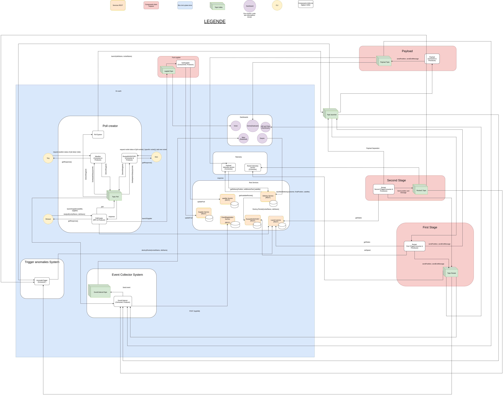
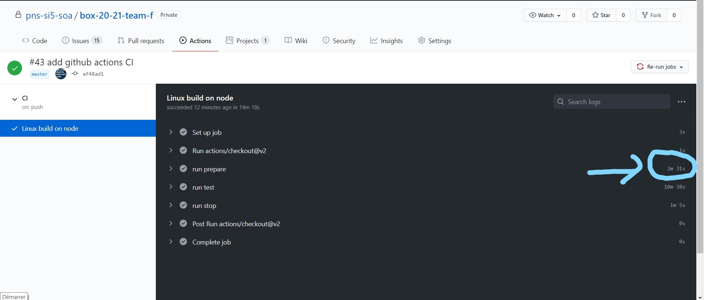
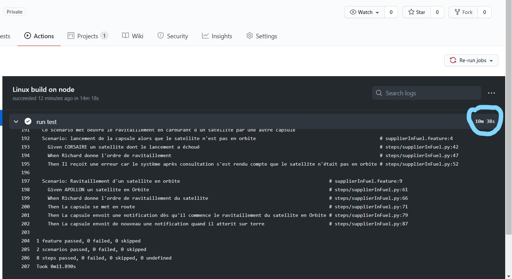

# blue-origin-x-20-21-soa-20-21-f
* Auteurs: **Team F**
    * AINADOU Florian
    * DJEKINOU Paul-Marie
    * KOFFI Paul
    * NABAGOU Djotiham
* Version actuelle : DELIVERY-FINAL
* Livrables :
    * [delivery-first](https://github.com/pns-si5-soa/box-20-21-team-f/releases/tag/delivery-first) : Première livraison
    * [delivery-final](https://github.com/pns-si5-soa/box-20-21-team-f/releases/tag/delivery-final) : Livraison finale
* Statuts d'Intégration continue : [](https://travis-ci.com/pns-si5-soa/box-20-21-team-f)
  
# Vue d'ensemble
 Cette étude de cas est utilisée pour illustrer les différentes technologies impliquées dans le cours d'Architecture Orienté Services (SOA) donné à Polytech Nice - Sophia Antipolis en 5e année. Ce code de démonstration nécessite les technologies suivantes pour fonctionner correctement :
       
   * Environnement de déploiement : Docker 2.2.0.5 (Stable)
   * Langage d'implémentation Python & Pip : Python3 & Pip3
   
   
  ## Vision du produit
  La dernière version du produit à implémenter est décrite  [ici](./docs/scope_final.pdf).
    
  L'architecture logicielle à développer dans ce projet est incrémentale et évolue tout le long du projet.
  
  Le schéma final d'architecture se présente comme suit : 
  <p align="center">
      
  </p>
  
 ## Rapport du projet
 Le rapport final du projet se trouve 👉 [ici](./docs/rapport-delivery-final.pdf)
 
 PS : 
 * Toutes les images et illustrations utilisées dans ce rapport et dont les dimensions sont réduites en raison du format A4, sont disponibles en taille *réelle* dans le répertoire [docs](./docs) à la racine de ce projet.
 * S'assuer d'être bien authentifié sur github (ou d'avoir les droits sur le repo) si accès aux images directement depuis les liens inscrits dans le rapport (en légende des figures).
 * Le rapport du livrable *delivery-first* est également disponible 👉 [ici](./docs/rapport-delivery-first.pdf)
 
 
  
  ## Comment utiliser ce repository
  * La branche `master` (la branche par défaut) représente la dernière version stable du système.
  * La branche `develop` représente le système en cours de développement en parallèle des autres branches de développement spécifiques à des problématiques ou relatifs aux diverses tâches attribuées.
  * Les issues peuvent être créés en utilisant le [système de ticket de Github](https://github.com/pns-si5-soa/blue-origin-x-20-21-soa-20-21-f/issues)
  
  ### Récupération du projet
  Effectuer un clone classique du projet en faisant ```git clone https://github.com/pns-si5-soa/box-20-21-team-f.git``` ou en récupérant le zip depuis cette page.
  
  ## Compilation & Exécution  
  La compilation et l'exécution s'effectuent via des conteneurs *Docker* correspondants aux différents micro-services et autres acteurs du système.
  Le lancement et démarrage de ces conteneurs est automatisé grace à l'exécution de scripts.
     
  *Compilation & Exécution :* Exécuter le fichier [prepare.sh](./prepare.sh) à la racine du projet afin de compiler et exécuter toutes les images docker.
  PS : 
    - La première fois, la compilation et exécution (prepare.sh) peut prendre du temps en raison du téléchargement des images docker.
    - L'exécution du fichier [run.sh](./tests/features/run.sh) faisant tourner les scénarios et tests d'acceptance est automatisé et se fait directement pendant le *prepare.sh* après le téléchargement des images docker.  
  
  <p align="center">
    
  </p>

  <p align="center">
    
  </p>
  
  Vous pouvez vous rendre dans la partie github Actions pour voir en détail l'exécution du prépare et des tests.
  
  ## Pile technologique
  
  <p align="center">
    
  </p>
